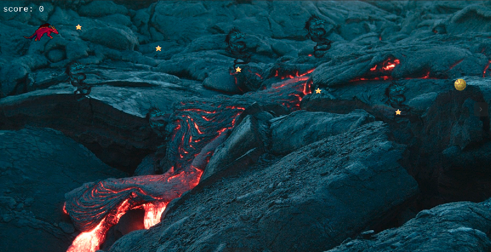
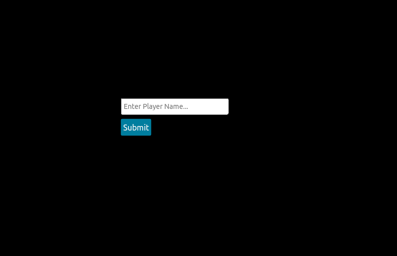
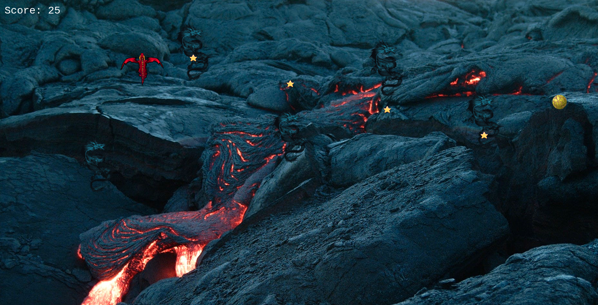
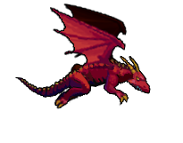

# GAME DESIGN DOCUMENT

 

## DRAGON WARS

## Author

👤 **Kaboha Jean Mark**

- GitHub: [@KabohaJeanMark](https://github.com/KabohaJeanMark)
- Twitter: [@jean_quintus](https://twitter.com/jean_quintus)
- LinkedIn: [Jean Mark Kaboha](https://www.linkedin.com/in/jean-mark-kaboha-software-engineer/)

## Overview
- Timeline: 3 weeks have gone into Researdh, Design and Development
- Budget: This is free for all users to enjoy.

## Story
> dragon-wars is a fun game about a battle taking place between giant celestial beings dragons in the volcano planet. The red player character dragon has to fly through and avoid the claws and talons.

## Gameplay

1. Enter player name so the game knows who is playing and will record your score

 

2. Navigate with the arrows, Up, Left, Right and Down on your keyboard as your character to make the red dragon fly through a field of enemy blue dragons. If it touches the blue dragon, game over.

 

3. Eat stars to get a high score by moving towards them. Each star increases layer score by 25 points. When you finish eating all the stars, more stars appear.

4. By eating the celestial yellow dragon egg, you get 100 points; much more than each star's 25 points. 

## Game elements

👤 **Characters**

Red Dragon (Main Character)

Blue Dragon (Villain) 

 

**Location**

The volcano realm

 

**Mission Objects**

Celestial Dragon Egg

Stars

  

**Sound**

- Game of Thrones main title Original Soundtrack Theme song by Ramin Djawadi.

**Animation**

- The flight of the red dragon as it changes directions

   
