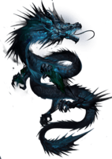

# dragon-wars

## About
> dragon-wars is a fun game about a battle taking place between giant celestial beings dragons in the volcano planet. The red player character dragon has to fly through and avoid the claws and talons.

### Play Now

[Click here](https://kabohajeanmark.github.io/dragon-wars/)

### Different game screens

| Menu | Music options | Top Scores |
|:---:|:---:|:---:|
|  | |  |

### GamePlay 
1. Enter player name so the game knows who is playing and will record your score

 

2. Navigate with the arrows, Up, Left, Right and Down on your keyboard as your character to make the red dragon fly through a field of enemy blue dragons. If it touches the blue dragon, game over.

 

3. Eat stars to get a high score by moving towards them. Each star increases layer score by 25 points. When you finish eating all the stars, more stars appear.

4. By eating the celestial yellow dragon egg, you get 100 points; much more than each star's 25 points. 

## Game Characters

Red Dragon (Main Character)

   

Blue Dragon (Villain) 

 

Celestial Dragon Egg

Stars

  

## Built With

- HTML5 & CSS3
- JavaScript
- Phaser 3 Gaming Framework

ES6 support through for a Modern JavaScript touch via [Babel 7](https://babeljs.io/) and [Webpack 5](https://webpack.js.org/) that includes hot-reloading for development and production-ready builds.
Loading images via JavaScript module `import` is also supported, although not recommended.

## Requirements

[Node.js](https://nodejs.org) is required to install dependencies and run scripts via `npm`.

## Instructions
To get a local copy up and running follow these simple example steps.

### Prerequisites
- Gitbash installed to navigate between the branches.
- A preferred text editor for example VS Code.
- A browser such as Google Chrome

### Install
Clone this [GitHub Repo](https://github.com/KabohaJeanMark/jersey-directory/tree/ft-main-page) to your computer on yourFolder by typing these commands in the terminal or download as a Zip file and extract.

#### Available Commands

| Command | Description |
|---------|-------------|
| `mkdir yourFolder` | Create a folder of your choice to store the project |
| `cd yourFolder` | Change directory into that folder |
| `git clone https://github.com/KabohaJeanMark/jersey-directory/tree/ft-main-page` | CLone and copy the project into that folder |
| `npm install` | Install project dependencies |
| `npm start` | Build project and open web server running project |
| `npm run build` | Builds code bundle with production settings (minification, uglification, etc..) |

#### Testing the app

| Command | Description |
|---------|-------------|
| `npm run test` | Runs unit tests on the different modules and functions within them |

### Usage
- View with live Server in VS code or Right click and open the index.html in your browser to view.

## Author

👤 **Kaboha Jean Mark**

- GitHub: [@KabohaJeanMark](https://github.com/KabohaJeanMark)
- Twitter: [@jean_quintus](https://twitter.com/jean_quintus)
- LinkedIn: [Jean Mark Kaboha](https://www.linkedin.com/in/jean-mark-kaboha-software-engineer/)

## 🤝 Contributing

Contributions, issues, and feature requests are welcome!

Feel free to check the [issues page](https://github.com/KabohaJeanMark/dragon-wars/issues).

## Show your support

Give a ⭐️ if you like this project!

## Acknowledgments

- Hat tip to Microverse for the README template, instructions and tutoring for this JavaScript Capstone project.

## Inspirations
- Game of Thrones main title theme song by Ramin Djawadi.

## 📝 License

This project is [MIT](./LICENSE) licensed.
